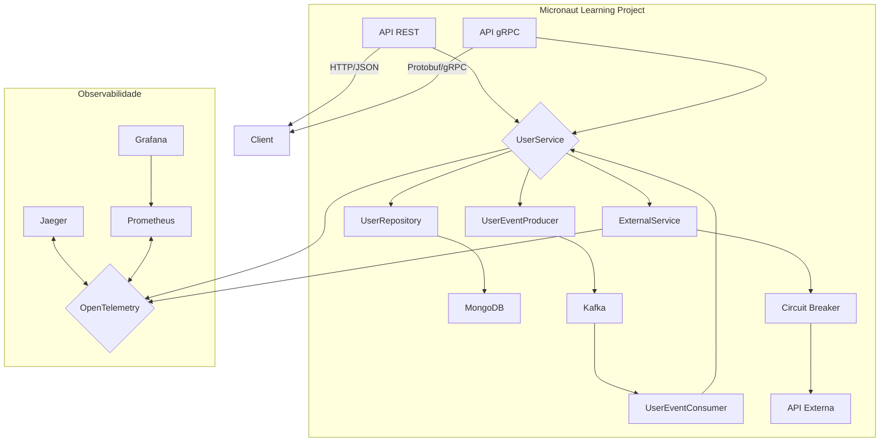

# Micronaut Learning Project for Senior .NET Developers

      

## 1. Introdução

Este projeto foi criado como um guia de aprendizado para desenvolvedores .NET sênior que desejam aprender Java e o framework Micronaut. O objetivo é demonstrar conceitos modernos de desenvolvimento de microserviços em Java, usando um conjunto de tecnologias de mercado e estabelecendo paralelos com o ecossistema .NET.

### 1.1. Objetivo do Projeto

O projeto implementa um serviço de gerenciamento de usuários com as seguintes features:

- **APIs REST e gRPC:** Exposição de endpoints para operações CRUD de usuários.
- **Mensageria com Kafka:** Produção e consumo de eventos de usuário (criação, atualização, exclusão) e notificações, usando serialização Protobuf.
- **Persistência com MongoDB:** Armazenamento de dados de usuário em um banco NoSQL.
- **Resiliência com Circuit Breaker:** Proteção contra falhas em serviços externos.
- **Observabilidade:** Rastreamento distribuído com OpenTelemetry/Jaeger e métricas com Prometheus/Grafana.
- **Injeção de Dependência:** Uso do padrão de injeção de dependência do Micronaut.
- **Lombok:** Redução de boilerplate code em DTOs e entidades.

### 1.2. Arquitetura de Alto Nível



### 1.3. Tecnologias Utilizadas

- **Framework:** Micronaut 4.2.1
- **Linguagem:** Java 17
- **Banco de Dados:** MongoDB 7.0
- **Mensageria:** Apache Kafka 7.5.1
- **Serialização:** Protocol Buffers (Protobuf) 3.25.1
- **Schema Registry:** Confluent Schema Registry 7.5.1
- **Circuit Breaker:** Resilience4j 2.1.0
- **Observabilidade:**
  - **Tracing:** OpenTelemetry + Jaeger 1.51
  - **Métricas:** Micrometer + Prometheus 2.47.2
  - **Dashboards:** Grafana 10.2.0
- **Build Tool:** Maven 3.9.5
- **Containerização:** Docker Compose

## 2. Primeiros Passos

### 2.1. Pré-requisitos

- **JDK 17+:** [OpenJDK](https://openjdk.java.net/) ou [Amazon Corretto](https://aws.amazon.com/corretto/)
- **Docker e Docker Compose:** [Docker Desktop](https://www.docker.com/products/docker-desktop)
- **IDE (opcional):** [IntelliJ IDEA](https://www.jetbrains.com/idea/) ou [VS Code com extensions Java](https://code.visualstudio.com/docs/java/java-tutorial)

### 2.2. Iniciando a Infraestrutura

O Docker Compose provisiona toda a infraestrutura necessária. Para iniciar, execute o script:

```bash
./scripts/start-infrastructure.sh
```

Este comando irá iniciar:

- MongoDB
- Zookeeper
- Kafka
- Schema Registry
- Jaeger
- Prometheus
- Grafana
- Kafka UI
- Redis

### 2.3. Iniciando a Aplicação Micronaut

Para iniciar a aplicação, use o Maven wrapper:

```bash
./mvnw compile exec:java
```

Ou use o script utilitário:

```bash
./scripts/run-application.sh
```

A aplicação estará disponível em `http://localhost:8080`.

### 2.4. Verificando os Serviços

- **Grafana:** `http://localhost:3000` (admin/admin123)
- **Jaeger:** `http://localhost:16686`
- **Prometheus:** `http://localhost:9090`
- **Kafka UI:** `http://localhost:8080`

## 3. Estrutura do Projeto

```
micronaut-learning-project
├── docker/                  # Configurações do Docker Compose
├── scripts/                 # Scripts utilitários
├── src/
│   ├── main/
│   │   ├── java/com/learning/micronaut/
│   │   │   ├── Application.java   # Ponto de entrada da aplicação
│   │   │   ├── controller/        # Controllers REST
│   │   │   ├── dto/               # Data Transfer Objects (DTOs)
│   │   │   ├── entity/            # Entidades do MongoDB
│   │   │   ├── grpc/              # Serviços gRPC
│   │   │   ├── kafka/             # Produtores e consumidores Kafka
│   │   │   ├── observability/     # Serviços de observabilidade
│   │   │   ├── repository/        # Repositórios Micronaut Data
│   │   │   └── service/           # Serviços de negócio
│   │   ├── proto/             # Arquivos .proto (Protobuf)
│   │   └── resources/         # Arquivos de configuração (application.yml)
│   └── test/                  # Testes unitários e de integração
├── pom.xml                  # Configuração do build (dependências, plugins)
├── mvnw                     # Maven wrapper script
├── mvnw.cmd                 # Maven wrapper script (Windows)
├── .mvn/                    # Configurações do Maven wrapper
└── README.md                # Este arquivo
```

### ⚖️ Comparação com .NET

- **`src/main/java`** é equivalente ao diretório do projeto C#.
- **`pom.xml`** é similar ao arquivo `.csproj`, definindo dependências e configurações do build.
- **`Application.java`** é o ponto de entrada, similar ao `Program.cs` no ASP.NET Core.
- **`controller`** é análogo aos `Controllers` no ASP.NET Core.
- **`service`** é onde a lógica de negócio reside, similar aos `Services`.
- **`repository`** é similar aos `Repositories` ou `DbContext` no Entity Framework.
- **`dto`** e **`entity`** são análogos aos `DTOs` e `Models`.
- **`resources`** contém arquivos de configuração, como o `appsettings.json`.

## 4. Conceitos e Features (Deep Dive)

### 4.1. Micronaut Framework

Micronaut é um framework Java moderno focado em microserviços e serverless. Sua principal característica é a compilação AOT (Ahead-of-Time), que resolve a injeção de dependência em tempo de compilação, resultando em:

- **Startup rápido:** Essencial para serverless e escalonamento rápido.
- **Baixo consumo de memória:** Menor overhead de reflexão.
- **Nativo-friendly:** Facilita a criação de imagens nativas com GraalVM.

#### ⚖️ Comparação com ASP.NET Core

- **Injeção de Dependência:** Micronaut usa anotações (`@Singleton`, `@Inject`) e o DI container é resolvido em tempo de compilação. ASP.NET Core usa `IServiceCollection` e o DI é resolvido em tempo de execução.
- **Configuração:** Micronaut usa `application.yml` (ou `.properties`), similar ao `appsettings.json`.
- **Controllers:** Anotações como `@Controller`, `@Get`, `@Post` são análogas aos atributos `[ApiController]`, `[HttpGet]`, `[HttpPost]`.
- **Middleware:** Micronaut usa `HttpServerFilter`, similar aos `Middleware` no ASP.NET Core.

### 4.2. Injeção de Dependência e Beans

Micronaut usa o padrão JSR-330 para injeção de dependência. As principais anotações são:

- **`@Singleton`:** Cria uma única instância da classe (similar a `services.AddSingleton`).
- **`@Prototype`:** Cria uma nova instância a cada injeção (similar a `services.AddTransient`).
- **`@Inject`:** Injeta uma dependência (similar a injetar no construtor no .NET).

**Exemplo (`UserService.java`):**

```java
@Singleton
@RequiredArgsConstructor // Lombok gera construtor com injeção
public class UserService {
    private final UserRepository userRepository;
    private final UserMapper userMapper;
    // ...
}
```

### 4.3. Lombok: Reduzindo Boilerplate

Lombok é uma biblioteca que gera código Java em tempo de compilação, eliminando a necessidade de escrever getters, setters, construtores, etc.

- **`@Data`:** Gera getters, setters, `toString`, `equals`, `hashCode`.
- **`@Builder`:** Implementa o padrão Builder.
- **`@NoArgsConstructor`, `@AllArgsConstructor`:** Gera construtores.
- **`@Slf4j`:** Gera um logger estático.

#### ⚖️ Comparação com .NET

- **Records (C# 9+):** `records` no C# são a forma mais próxima do `@Data` do Lombok, fornecendo imutabilidade e métodos gerados.
- **Propriedades Automáticas:** `public string Name { get; set; }` é o padrão no C#, enquanto em Java seria necessário escrever `getName()` e `setName()` manualmente (ou usar Lombok).

### 4.4. APIs: REST vs. gRPC

O projeto expõe duas APIs para as mesmas operações:

1.  **API REST (`UserController.java`):**
    - Usa JSON como formato de dados.
    - Segue o padrão RESTful.
    - Ideal para comunicação com front-ends e sistemas externos.

2.  **API gRPC (`UserGrpcService.java`):**
    - Usa Protocol Buffers (Protobuf) para serialização binária.
    - Baseada em HTTP/2, mais eficiente para comunicação entre serviços.
    - Contratos fortemente tipados definidos em arquivos `.proto`.

#### ⚖️ Comparação com .NET

- **ASP.NET Core Web API vs. gRPC Services:** A estrutura é muito similar. Em ambos, você define um serviço e implementa os métodos. A principal diferença é a forma como o contrato é definido (OpenAPI/Swagger para REST, Protobuf para gRPC).

### 4.5. Persistência com MongoDB e Micronaut Data

Micronaut Data simplifica o acesso a dados, gerando implementações de repositório em tempo de compilação.

- **`@MappedEntity`:** Marca uma classe como entidade (similar ao `[Table]` no EF Core).
- **`@Id`, `@GeneratedValue`:** Define a chave primária.
- **`MongoRepository`:** Interface que, quando estendida, gera automaticamente os métodos CRUD.

**Query Methods:** Micronaut Data gera queries baseadas no nome do método:

```java
// Busca usuário por email
Publisher<User> findByEmail(String email);

// Busca usuários por status
Publisher<User> findByStatus(UserDto.UserStatus status);
```

#### ⚖️ Comparação com .NET

- **Micronaut Data vs. Entity Framework Core:**
  - **Geração de Queries:** Micronaut Data usa nomes de métodos, enquanto EF Core usa LINQ.
  - **Conexão:** Micronaut Data é mais leve e focado em repositórios, enquanto `DbContext` no EF Core é mais complexo (Unit of Work, Change Tracking).
  - **Reatividade:** Micronaut Data suporta programação reativa (Project Reactor) nativamente, similar ao `IAsyncEnumerable` no .NET.

### 4.6. Mensageria com Kafka e Protobuf

O projeto usa Kafka para comunicação assíncrona entre serviços.

- **`@KafkaClient` (`UserEventProducer.java`):** Define um produtor Kafka. O Micronaut gera a implementação.
- **`@KafkaListener` (`UserEventConsumer.java`):** Define um consumidor Kafka. O método anotado é chamado para cada mensagem.
- **Protobuf:** As mensagens são serializadas em Protobuf para maior eficiência e evolução de schema.
- **Schema Registry:** Gerencia os schemas Protobuf, garantindo compatibilidade entre produtor e consumidor.

#### ⚖️ Comparação com .NET

- **Micronaut Kafka vs. Confluent.Kafka .NET:**
  - **Abstração:** Micronaut oferece uma abstração de alto nível com anotações, enquanto a biblioteca .NET é mais de baixo nível, exigindo mais configuração manual (mas oferecendo mais controle).
  - **Serialização:** Ambos suportam Protobuf com Schema Registry, mas a configuração no Micronaut é mais integrada ao framework.

### 4.7. Resiliência com Circuit Breaker (Resilience4j)

Para proteger a aplicação contra falhas em serviços externos, usamos o padrão Circuit Breaker com a biblioteca Resilience4j.

- **`@CircuitBreaker`:** Anotação que aplica o padrão a um método.
- **`fallbackMethod`:** Define um método de fallback a ser chamado quando o circuito está aberto.
- **`@Retry`:** Tenta novamente a chamada em caso de falha.

**Exemplo (`ExternalService.java`):**

```java
@CircuitBreaker(name = "external-service", fallbackMethod = "validateEmailFallback")
@Retry(name = "external-service")
public Mono<Boolean> validateEmail(String email) {
    // ...
}

public Mono<Boolean> validateEmailFallback(String email, Exception exception) {
    // ...
}
```

#### ⚖️ Comparação com .NET

- **Resilience4j vs. Polly:** Ambos são bibliotecas de resiliência muito populares. A sintaxe é diferente (anotações em Java vs. configuração de políticas em C#), mas os conceitos (Circuit Breaker, Retry, Fallback, Timeout) são os mesmos.

### 4.8. Observabilidade (OpenTelemetry, Jaeger, Prometheus)

- **Tracing Distribuído (OpenTelemetry + Jaeger):**
  - Micronaut tem integração nativa com OpenTelemetry.
  - **`@NewSpan`:** Cria um novo span para um método, permitindo rastrear a execução.
  - **`@SpanTag`:** Adiciona tags a um span.
  - Os traces podem ser visualizados no Jaeger UI (`http://localhost:16686`).

- **Métricas (Micrometer + Prometheus + Grafana):**
  - Micrometer é a fachada de métricas (similar ao `System.Diagnostics.Metrics` no .NET).
  - O endpoint `/prometheus` expõe as métricas para o Prometheus.
  - Um dashboard pré-configurado no Grafana (`http://localhost:3000`) exibe as métricas.

#### ⚖️ Comparação com .NET

- **OpenTelemetry:** É o padrão em ambos os ecossistemas. A instrumentação automática no Micronaut é muito poderosa, mas o .NET também tem excelente suporte.
- **Métricas:** Micrometer é o padrão de fato no mundo Java, enquanto no .NET usa-se `System.Diagnostics.Metrics`. Prometheus e Grafana são usados em ambos os ecossistemas.

## 5. Scripts Utilitários

O diretório `scripts/` contém scripts para facilitar o gerenciamento do ambiente:

- **`start-infrastructure.sh`:** Inicia toda a infraestrutura Docker.
- **`stop-infrastructure.sh`:** Para todos os containers. Use `--clean` para remover os volumes de dados.
- **`check-services.sh`:** Verifica o status de todos os serviços.
- **`setup-kafka-topics.sh`:** Cria os tópicos Kafka necessários para a aplicação.
- **`run-application.sh`:** Compila e executa a aplicação Micronaut.
- **`run-tests.sh`:** Executa os testes unitários e de integração.
- **`build-application.sh`:** Faz o build completo e cria o JAR executável.

## 6. Conclusão

Este projeto serve como um ponto de partida para desenvolvedores .NET explorarem o ecossistema Java moderno. Embora as sintaxes e bibliotecas sejam diferentes, muitos dos conceitos e padrões de arquitetura são universais. O Micronaut, em particular, oferece uma experiência de desenvolvimento muito produtiva e performática, com várias semelhanças com o ASP.NET Core.

### 💡 Dicas para Desenvolvedores .NET

- **Build System:** Maven é o sistema de build mais comum em Java, similar ao MSBuild/NuGet. O `pom.xml` é o coração do projeto, definindo dependências, plugins e perfis de build.
- **IDE:** IntelliJ IDEA é o padrão ouro para desenvolvimento Java, com excelente integração com Gradle/Maven.
- **Programação Reativa:** O ecossistema Java usa muito programação reativa (Project Reactor: `Mono`/`Flux`). `Mono<T>` é similar a `Task<T>`, e `Flux<T>` é similar a `IAsyncEnumerable<T>`.
- **Anotações vs. Atributos:** Anotações em Java (`@Singleton`) são o equivalente aos atributos em C# (`[Singleton]`).
- **Comunidade:** A comunidade Java é vasta e madura. Stack Overflow, Baeldung e os blogs da Confluent e do Micronaut são excelentes recursos.

---

